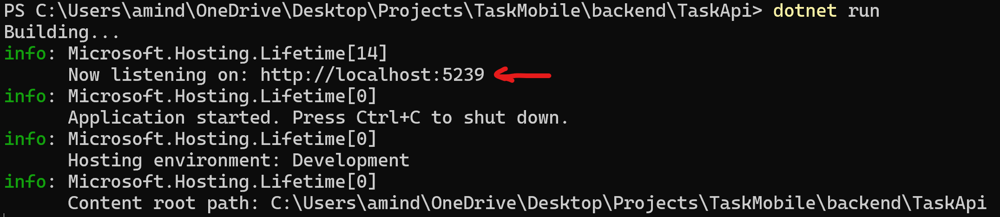
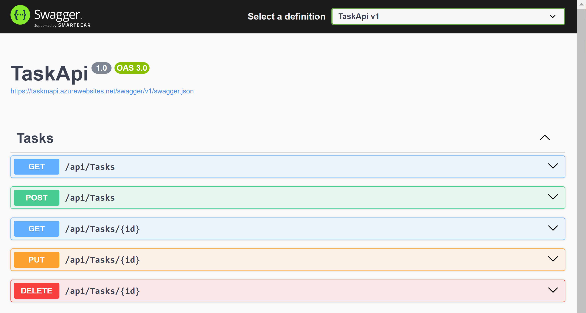

# Task API (Backend)

This is the backend for the Task Manager built with ASP.NET Core and EF Core. It provides endpoints for managing tasks with operations such as create, read, update, and delete (CRUD). This README will guide you through setting up the API locally.

## Project Structure

- `TaskApi`: The main API project containing controllers, models, and database context.
- `TaskApi.Tests`: The test project containing unit and integration tests for the API.

## Prerequisites

Before you begin, ensure you have the following installed on your machine:

- [.NET 8.0 SDK](https://dotnet.microsoft.com/download/dotnet/8.0)
- [Azure Cosmos DB Emulator](https://docs.microsoft.com/en-us/azure/cosmos-db/local-emulator) (or an actual Cosmos DB account using Azure)
- [Visual Studio 2022](https://visualstudio.microsoft.com/)

## Setup Instructions

1. **Set Up Cosmos DB Hosted or Cosmos DB Emulator**

   If you're using the Azure Cosmos DB Emulator:

   - Install and start the Azure Cosmos DB Emulator.
   - Note the connection details (AccountEndpoint and AccountKey).

   If you're using an actual Cosmos DB account:

   - Ensure you have the connection details for your Cosmos DB account.

2. **Configure Connection Strings**

   Update the `appsettings.json` file located in the `TaskApi` project with your Cosmos DB connection details.

   ```json
   {
     "CosmosDb": {
       "Account": "https://localhost:8081", // Change this if using a live Cosmos DB
       "Key": "C2y6yDjf5VeG5lQ5gf5fK5e5g4df5g6f5f4g5df5==", // example key
       "DatabaseName": "TaskDatabase" // change it to your database's name
     }
   }
   ```

3. **Restore Packages**

   Ensure all necessary packages are restored. You can do this from the command line in `./TaskApi`:

   ```sh
   dotnet restore
   ```

4. **Build the Project**

   Open the solution in Visual Studio or your preferred IDE and build the project.

   Alternatively, you can build the project from the command line in `./TaskApi`:

   ```sh
   dotnet build
   ```

5. **Run the API**

   To run the API locally, use the following command in `./TaskApi`:

   ```sh
   dotnet run
   ```

   This will start the API and make it available at `http://localhost:5239` (it will also indicate which port the API is hosted on in the terminal).

   

6. **Swagger Documentation**

   Once the API is running, you can view the Swagger documentation at:

   ```
   https://localhost:5239/swagger
   ```

   

## Running Tests

1. **Run Tests**

   You can run the tests using the following command in the `/TaskApi.Tests` folder.

   ```sh
   dotnet test
   ```

## Endpoints

The API provides the following endpoints:

- `GET /api/tasks`: Retrieves all tasks.
- `GET /api/tasks/{id}`: Retrieves a specific task by ID.
- `POST /api/tasks`: Creates a new task.
- `PUT /api/tasks/{id}`: Updates an existing task.
- `DELETE /api/tasks/{id}`: Deletes an existing task.

## Troubleshooting

- Ensure the Cosmos DB Emulator or your Cosmos DB instance is running and accessible.
- Verify that the connection strings in the `appsettings.json` file are correct.
- Make sure all required NuGet packages are installed by running `dotnet restore
